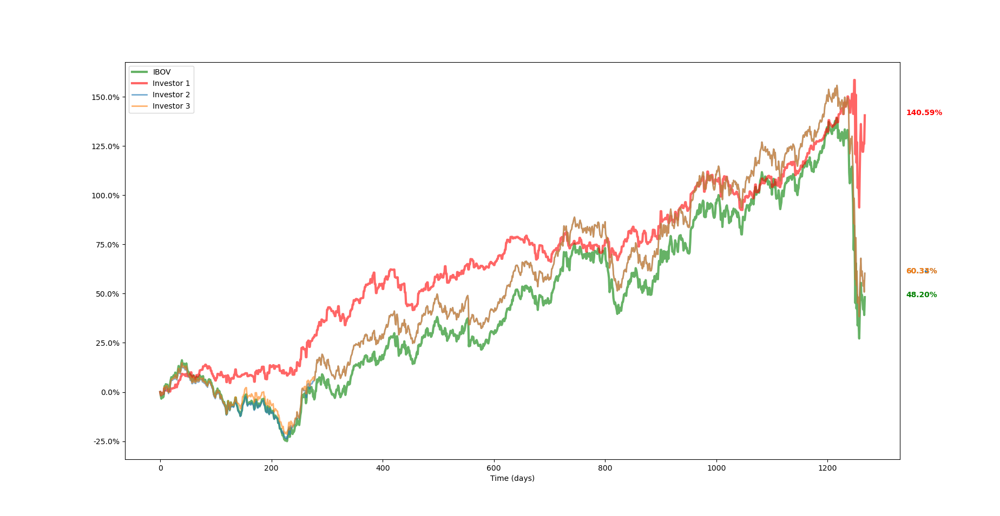

# Neuroevolutionary Investor
Neuroevolution-based system that simulates investments in the stock market, based on the BOVESPA index. Final project of the course _SSC0713 - Evolutionary systems applyied to robotics_.

VIDEO: work in progress

## Installation
First, make sure you have a recent version of Python 3. To install the dependencies, open a command shell in the project's root directory and execute the following:
- pip install -r requirements.txt

To run the program, use the command:
- python3 main.py

## How it works
To improve itself, the system uses concepts of **evolutionary computing**. Specifically, a **genetic algorithm**, metaheuristic inspired by the process of natural selection, is used. The evolution process used by the program can be summarized in the following steps:

* Generate a population of *n* individuals; each individual represents an investor.
* Repeat *e* times, where *e* is the number of *epochs* considered:
    * For each investor present in the population, do:
        * Simulate the investor's actions (buying and selling shares) in the stock exchange over a predefined period of time.
        * Calculate and save the investor's *fitness*, defined as the percentage of profit it made during the simulation.
    * Generate a new population of *n* individuals, following the steps:
        * Add the individual with the highest fitness (investor with the best profit) to the new population.
        * Repeat *n - 1* times:
            * Consider a probabilistic distribution in which individuals with higher fitness are more likely to be selected.
            * Select one individual *i1* of the old population (without removing it).
            * Create a new individual *i2* similar to *i1*, but with small, random differences (mutation).
            * Add *i2* to the new population.
    * Randomly select an individual (except for the one with the highest fitness) from the new population and kill it. 
    * Randomly generate a new individual and add it to the new population.
    * Discard the old population and restart the loop considering the new population.

## Trading shares of IBOVESPA
During the investment simulations, the investors are provided, for each trading day of the considered period, with historic data of the *BOVESPA Index* (or IBOVESPA), benchmark index of about 60 stocks that are traded on the B3 (Brasil Bolsa Balcão), which account for the majority of trading and market capitalization in the Brazilian stock market. The database, obtained at https://br.investing.com/, contains the opening and closing number of points the IBOVESPA had in each trading session from December 27 of 2000 to June 15 of 2020.

For the purposes of our simulations, the IBOVESPA is treated as an *exchange-traded fund* (ETF), i.e., an investment fund traded on stock exchanges, much like stocks. The price of each "IBOVESPA share" in a given instant is equal to the IBOVESPA divided by 1000.

## The investor
In each trading session, the investor (an individual of the population), represented by the class *Investor*, can decide to take one of the following actions:

   * **buy** IBOVESPA shares;
   * **do nothing**;
   * **sell** IBOVESPA shares.
   
The investor can take only one action in each trading day, during its end. In order to make a decision, the investor is provided, in each trading session, with the following informations:

   * the current amount of cash he has;
   * the number of shares he has;
   * the average price paid by the investor for his shares;
   * the closing price of the "IBOVESPA shares" for the past *d* days, where *d* is a predefined number.

The main component of each investor is his "brain". We give that name to the _**Artificial Neural Network**_ (*ANN*) responsible for making decisions for the investor. The ANN takes, as input, a vector with the information above. It outputs a real number *h*. The program rounds *h* to the nearest integer and interprets it as follows:

   * *h > 0*: action to buy *h* shares of IBOVESPA;
   * *h = 0*: no action;
   * *h < 0*: action to sell |*h*| shares of IBOVESPA.

## Evolving neural networks
As we've seen, the reproduction step occurs after each generation. The individuals with the best fitness are selected from the old population and used to generate individuals for a new population (the next generation). In the context of this project, this means that during the reproduction step the neural networks of the best investors of the past generation are selected and used to generate the neural networks of the new generation. The new neural networks have the same topology of their ancestors, but slightly different weights.

Our goal, by changing the weights of the ANNs in the population, is to achieve, after each generation, individuals with a higher fitness. The process of generating neural networks with evolutionary algorithms (a genetic algorithm, in our case) is called _**neuroevolution**_ (hence the name of the project).

## Reproduction
Two different reproduction techniques were tested in this project: ***elitism*** and ***reward-based selection***. The elitist approach selects the individual with the best fitness and mates him with all the other individuals in the population. The result of the mating of two individuals is a new neural network whose weights are the sum of its parents' weights divided by 2 and multiplied by a *mutation rate*.

In the reward-based approach, on the other hand, the probability of selecting an individual is proportional to its fitness. Given a sorted zero-indexed list with *n* individuals, where the worst-fitness individual occupies the index 0 and the best-fitness individual occupies the index *n - 1*, the chance of the individual in the index *i* to be picked is given by 2*i* divided by the sum of the whole distribution. When selected, the weights of the individual's neural network are multiplied by a mutation rate and used to generate a new ANN, that will belong to an individual of the new generation.

The reward-based reproduction was the one that yielded the best results. In both cases, the best individual was preserved between generations. In addition, after the reproduction stage, one individual of the new population was randomly killed and replaced by a new randomly generated individual. This strategy, called *predation* (Simões & Barrone, 2002), was used to avoid local optimums, adding new "genetic material" to the population.

to_do: a mutable mutation rate (the mutation rate gets higher when the population hasn't been changing much in the past few epochs).

## Results
to_do: using different data to train and evaluate the system

to_do: how did the investors handle crisis?

to_do: general results

  
 
